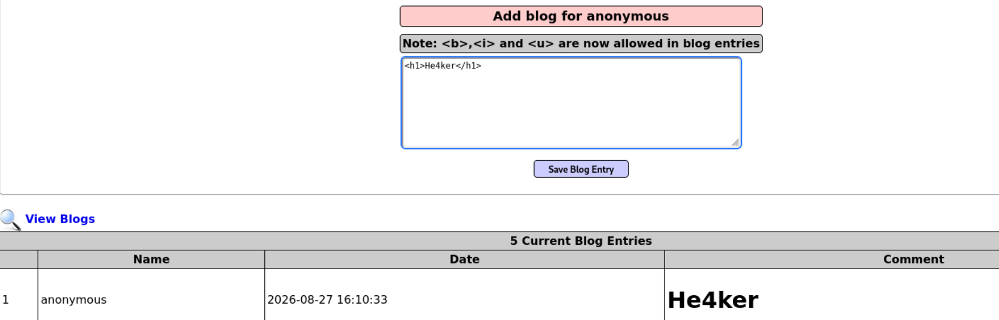
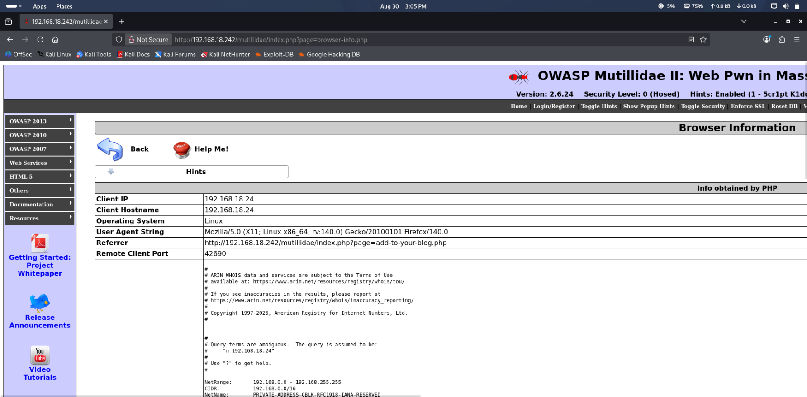
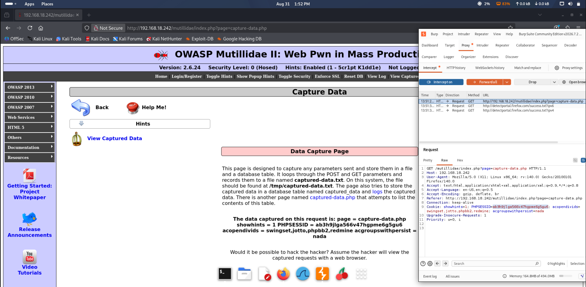
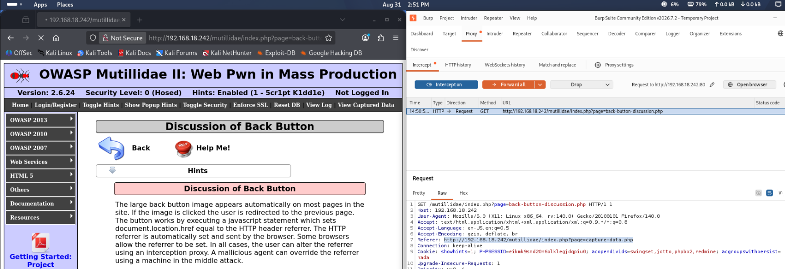
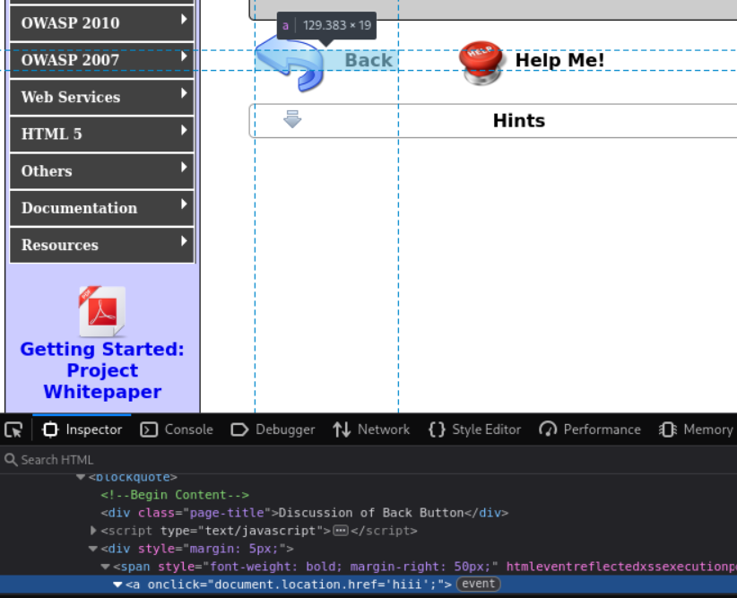
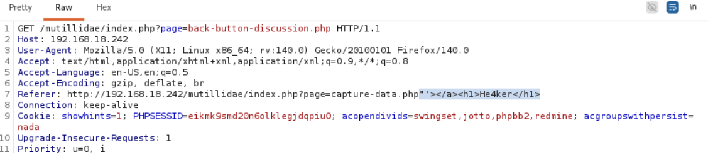
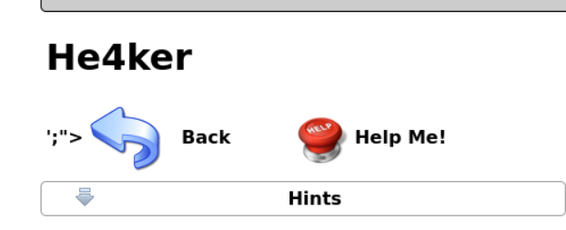

# HTML Injection

## Overview
HTML injection occurs when an attacker injects HTML code into an unfiltered input field. This allows the attacker to modify the website's appearance, text size, background, and even redirect users to malicious sites. When combined with XSS, it can execute scripts that harm the client's computer.

---

## Lab Setup
- **Target:** OWASP BWA (Broken Web Applications)
- **Vulnerable App:** OWASP Mutillidae II
- **Tool:** Burpsuite (proxy configured on local IP and port)

---


## Navigation Path

1. Open OWASP Mutillidae II in browser
2. Make sure Burpsuite proxy is configured and running
3. On top-left, click **OWASP 2013** → **A1-Injection (Other)** → **HTML Injection (HTMLi)**
4. Multiple vulnerable pages appear


---

---

### Method 1 — Direct Input Field

**Target page:** Add to your blog

The input field accepts HTML directly without filtering. Injected a simple heading tag:

```html
<h1>He4ker</h1>
```

Result — the heading rendered on the page in large text, confirming the input field is vulnerable. No filtering applied.



---

### Method 2 — No Input Field (Burpsuite Intercept)

**Target page:** Browser Info page

This page has no visible input fields — normally you can't inject anything directly. But every HTTP request contains headers that the server processes. By intercepting the request in Burpsuite and modifying the headers, we can still inject HTML.



**Steps:**
1. Turn Burpsuite intercept ON
2. Navigate to the Browser Info page
3. Request gets caught in Burpsuite
4. Find the `User-Agent` header

    

5. Delete the existing content and replace with HTML code
6. Forward the request


**Result** — the injected HTML rendered on the page successfully despite no visible input field existing.


---

### Key Lesson

You don't always need a visible input field to inject content. Any data the server reads and displays back — headers, cookies, URL parameters — is a potential injection point. Burpsuite lets you modify all of it.

---

### Method 2 — HTML Injection via Cookie

**Target page:** capture data page

Here also you won't find any input field.

---

## How It Works

1. First set up Burpsuite
2. Turn on intercept
3. Intercept that page
4. You will get HTTP request
5. In that we have to change cookie value which is PHPSESSID

Here what we will do is we inject HTML code in cookie value and that will allow us to redirect to different sites.



---

## ⚠️ Warning

Attacker may redirect you to different sites, so be careful when visiting harmful websites.

---

## Example Payload

```html
<meta http-equiv="refresh" content="2; URL=https://www.google.com"/>
```

### What This Does
- This HTML code allows us to redirect to Google page
- `content = 2` means after 2 seconds we will be directed to google.com
- Meta tag allows us to refresh page

---
## ❌ The Space Mistake I Made

I wrote this (WRONG):
```html
<meta http-equiv="refresh" content="2; URL = https://www.google.com"/>
```
Note the space between `URL` and `=` → **This doesn't work!**

### What Happened
- Browser couldn't parse the URL because of the space
- Got error: `The requested URL /mutillidae/URL_ = https://www.google.com was not found on this server.`
- Server tried to find a file named `URL_ = https://www.google.com`

### The Fix
Remove the space between `URL` and `=`:

```html
<meta http-equiv="refresh" content="2; URL=https://www.google.com"/>
```

### Lesson Learned
- Browsers are strict about `URL=` syntax
- Spaces break the redirect
- Always check for extra spaces in HTML attributes

---

## 🔍 Key Points

- No input field required
- PHPSESSID cookie is vulnerable
- Can redirect to any website
- Used in capture data page
- Works by injecting HTML in cookie value
- **Spaces matter!** Don't put space between `URL` and `=`
  
---
### Method 4 — HTML Injection via Back Button

**Target page:** Referer Header

Under HTMLi injection (those back buttons).

---

## What We Do

As the name suggests, when we press back button it redirects us to previous page. Now we want to intercept and modify it and make that back button execute HTML injection.

---

## Step-by-Step

1. Turn on intercept mode on Burpsuite
2. Intercept the page
3. In the request you will find the `Referer` section which does that work to get us to previous page
4. That is where we put our HTML code and that will work



---

## Testing the Injection

First we need to check if we write `<h1>hiii</h1>` will that work.

But it didn't work.

---

## Inspecting the Page

We inspect page and find the button location and find that tag which contains the link to previous page.

When we sent that `hiii` we found this:

```html
<a onclick="document.location.href='hiii';"></a>
```


---

## The Exploit

Now what we have to do is to make HTML code work.

We make code like this:

```html
"'></a><h1>He4ker</h1>
```

So this closes all the tags and HTML injection will work.



---

## Result



## Key Points

- No input field required
- Referer header is where we inject
- Need to close existing tags first
- Use `"'></a>` to break out
- Then inject your HTML

---

*Lab: OWASP(Mutillidae)* 
