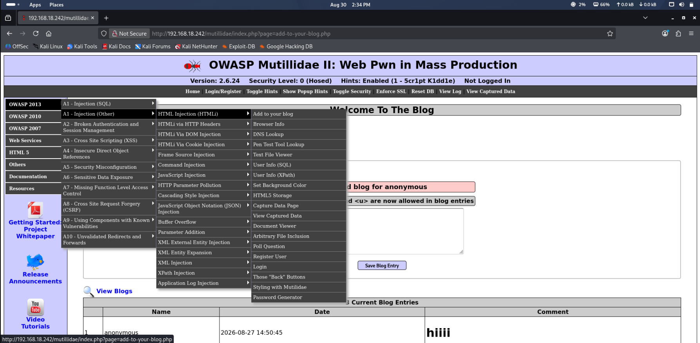
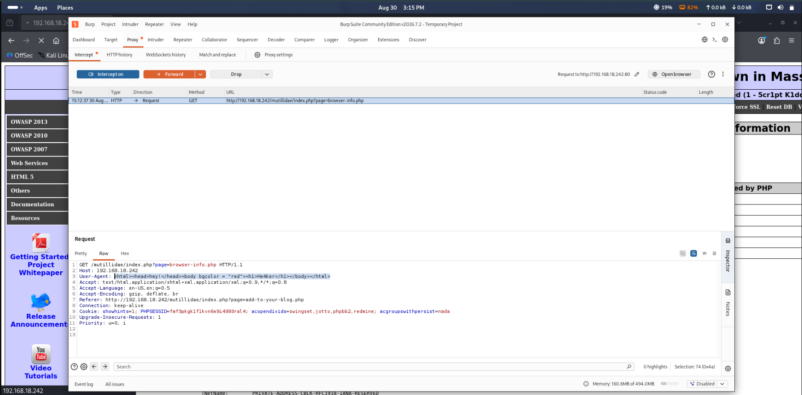
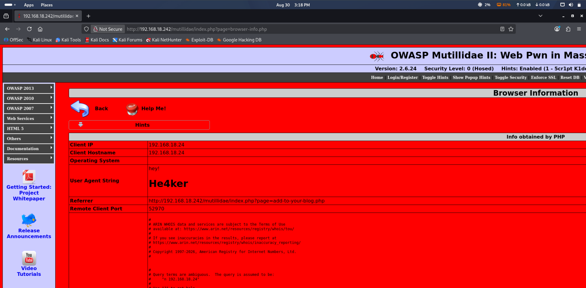

# HTML Injection

## Overview
HTML injection occurs when an attacker injects HTML code into an unfiltered input field. This allows the attacker to modify the website's appearance, text size, background, and even redirect users to malicious sites. When combined with XSS, it can execute scripts that harm the client's computer.

---

## Lab Setup
- **Target:** OWASP BWA (Broken Web Applications)
- **Vulnerable App:** OWASP Mutillidae II
- **Tool:** Burpsuite (proxy configured on local IP and port)

---


## Navigation Path

1. Open OWASP Mutillidae II in browser
2. Make sure Burpsuite proxy is configured and running
3. On top-left, click **OWASP 2013** → **A1-Injection (Other)** → **HTML Injection (HTMLi)**
4. Multiple vulnerable pages appear


---

---

### Method 1 — Direct Input Field

**Target page:** Add to your blog

The input field accepts HTML directly without filtering. Injected a simple heading tag:

```html
<h1>He4ker</h1>
```

Result — the heading rendered on the page in large text, confirming the input field is vulnerable. No filtering applied.


---

### Method 2 — No Input Field (Burpsuite Intercept)

**Target page:** Browser Info page

This page has no visible input fields — normally you can't inject anything directly. But every HTTP request contains headers that the server processes. By intercepting the request in Burpsuite and modifying the headers, we can still inject HTML.


**Steps:**
1. Turn Burpsuite intercept ON
2. Navigate to the Browser Info page
3. Request gets caught in Burpsuite
4. Find the `User-Agent` header

    

5. Delete the existing content and replace with HTML code
6. Forward the request


**Result** — the injected HTML rendered on the page successfully despite no visible input field existing.




---

### Key Lesson

You don't always need a visible input field to inject content. Any data the server reads and displays back — headers, cookies, URL parameters — is a potential injection point. Burpsuite lets you modify all of it.

---
