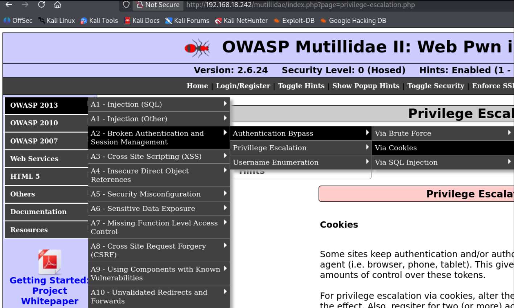
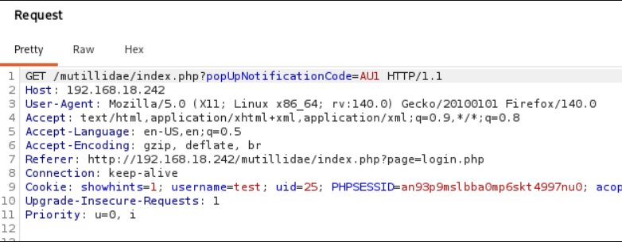
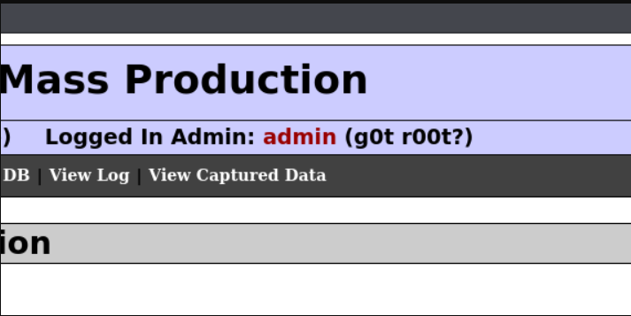
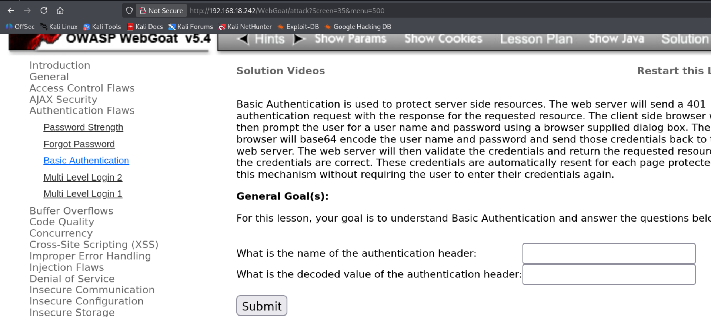
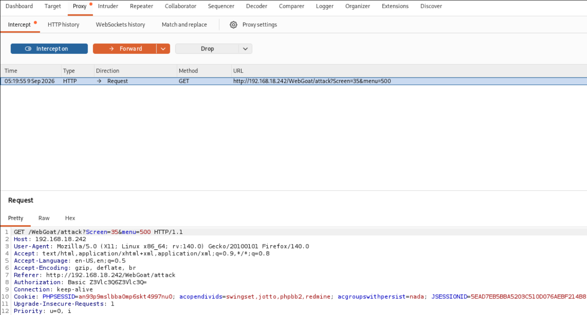
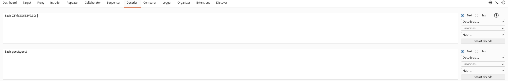
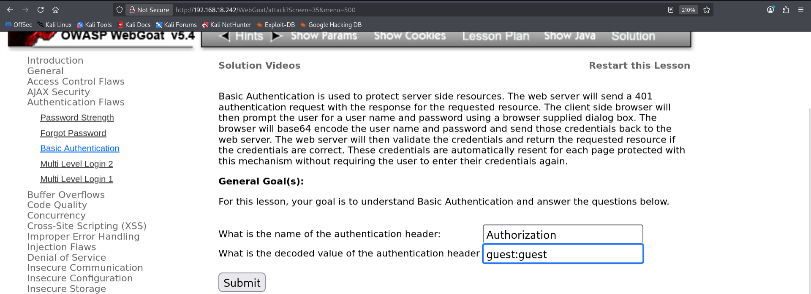

# Broken Authentication

## Overview
Broken Authentication is a vulnerability caused by weak login mechanisms, predictable session IDs, compromised cookies (stored in the user's browser), or brute force attacks. As the name suggests, it occurs when authentication functionality is not working properly.

---

## Examples of Broken Authentication

### Predictable Session IDs
```
User 1 session id: 001
User 2 session id: 002
User 3 session id: 003
```
If session IDs follow a predictable pattern, an attacker can guess the next user's session ID and hijack their account.

---

## Mitigation / Remediation

- Use a combination of characters, numbers, and symbols in passwords
- Limit the number of login attempts to mitigate brute force attacks
- Implement 2-Factor Authentication (2FA)
- Use unpredictable session and cookie values

---

## Practical — OWASP BWA

### Lab: Broken Authentication via Cookie

**Target:** OWASP Mutillidae II

**Navigation:** A2-Broken Authentication and Session Management → Authentication Bypass → Via Cookies

<details>
  <summary>📸 Click to view</summary>
  <br>
  
</details>

---

### Step 1: Create an Account

To perform this attack, we first need a valid account.

- Go to Login/Register tab
- Created account: test / password: test
- Login to that account

---

### Step 2: Intercept the Request

Make sure Burpsuite is running with intercept ON.

Reload the page and catch the request in Burpsuite.

In the Cookie field, we see something interesting:

username=test; uid=25

<details>
  <summary>📸 Click to view</summary>
  <br>
  
</details>

The server is relying on client-side cookie values to determine who we are — that's the vulnerability.

---

### Step 3: Attempt Admin Login

**First attempt — change username only:**

Change username=test to username=admin and forward the request.

**Result:** Nothing happened. The server didn't grant admin access based on username alone.

---

### Step 4: Change the UID

**Second attempt — change uid:**

Change uid=25 to uid=1 and forward the request.

**Result:** We are now logged in as admin.

<details>
  <summary>📸 Click to view</summary>
  <br>
  
</details>

---

## Root Cause

The vulnerability existed in the session management. The server trusted the uid value in the cookie without validating it against the actual session. Changing the uid gave us access to another user's account — in this case, admin.

---

## Key Takeaways

- Never trust client-side cookies for authentication
- Predictable or sequential session IDs are dangerous
- Always validate session data on the server side
- 2FA and rate limiting reduce the impact of broken authentication
- Cookie tampering is a simple but powerful attack when authorization checks are missing

# Basic Authentication in HTTP Request

## Overview
Basic Authentication is used to protect server-side resources from unauthorized access. To access those resources, we need valid credentials. After you log in, you can navigate to different pages without logging in again — your browser handles it automatically.

---

## How It Works

When you log in the first time, your browser caches (remembers) your username and password. For every subsequent page you visit, the browser automatically attaches the credentials to the HTTP request behind the scenes. The server does not remember you — your browser just keeps re-sending your credentials on your behalf.

Without this mechanism, you would have to enter credentials for every single page you visit.

---

## The Problem

The concerning thing is that credentials are encoded in Base64 — not encrypted. Base64 can be easily decoded using any Base64 decoder.

Also, if you are sending requests over HTTP (without SSL/TLS), your credentials are transmitted in plain text.

Your credentials are highly prone to being captured by attackers (MITM) and decoded easily since they are just Base64 encoded.

---

## Practical — OWASP WebGoat

### Step 1: Login

Head to OWASP WebGoat.

Login credentials: guest:guest

### Step 2: Navigate

Start WebGoat and on the left side you will see many types of attacks.

Navigate to: Authentication Flaws → Basic Authentication

<details>
  <summary>📸 Click to view</summary>
  <br>
  
</details>

---

### Step 3: Intercept with Burpsuite

Make sure Burpsuite is running with intercept ON.

Reload the site and catch the request.

In the Authorization header, we see:

Basic Z3Vlc3Q6Z3Vlc3Q=

<details>
  <summary>📸 Click to view</summary>
  <br>
  
</details>

If there is = at the end, that's a strong hint it's Base64 encoded.

---

### Step 4: Decode It

Copy the string Z3Vlc3Q6Z3Vlc3Q=

Go to Decoder tab in Burpsuite.

Choose Decode as: Base64 and paste the string in the input field.

Result:

guest:guest

<details>
  <summary>📸 Click to view</summary>
  <br>
  
</details>

<details>
  <summary>📸 Click to view</summary>
  <br>
  
</details>
---

## Key Takeaways

- Basic Authentication sends credentials in Base64 — not encrypted
- Base64 is easily reversible, not a security measure
- Without HTTPS, credentials travel in plain text and can be captured via MITM
- Burpsuite Decoder makes decoding trivial
- Always use HTTPS for transmitting credentials
- Basic Auth is convenient but insecure without additional protections
