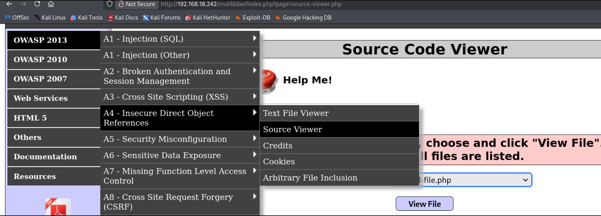

# Broken Access Control

## What is Access Control?

Access control is a security mechanism that regulates which users can view, modify, or interact with specific pages, directories, and resources on a web application. It enforces the rule of least privilege, ensuring users only access data necessary for their roles.

---

## What is Broken Access Control?

Broken Access Control is a critical security vulnerability that occurs when an application fails to properly enforce these restrictions. As a result, unauthorized users or attackers can bypass permissions to access sensitive data, modify content, or gain administrative privileges. It consistently ranks as one of the top web application security risks (such as in the OWASP Top 10).

---

## Insecure Direct Object Reference (IDOR)

An Insecure Direct Object Reference (IDOR) is a specific type of Broken Access Control. It occurs when an application exposes a direct reference to an internal implementation object — such as a database key, a filename, or a directory — in the URL or request parameters. If the server fails to validate the user's authorization to that object, an attacker can manipulate the parameter to access unauthorized data.

---

## Practical Example

Consider the following vulnerable URL:

`https://123.com/index.php?File=1.php`

In a secure application, the server verifies if the current user has permission to view `1.php`. However, if IDOR is present, an attacker can simply alter the parameter.

If the server displays the contents of `0.php` (or an administrative file like `admin.php`) without verifying permissions, the application is vulnerable to IDOR.

# Lab 1: Accessing the passwd File

## Overview

The passwd file stores essential user account information for Linux and Unix-like operating systems. In old Linux systems, it also stored passwords — but in modern systems, passwords are stored in the /etc/shadow file instead.

---

## Navigation

**Path:** Mutillidae II → OWASP 2013 → A4 - Insecure Direct Object References → Source Viewer

Here you can see it lists certain files and allows us to view their source code. But since this page may have a Broken Access Control vulnerability, we can try accessing other files on the system.

---

## Step 1: Intercept the Request

There is no visible input field, so we intercept the request in Burpsuite.

In the intercepted request, find the parameter:

phpfile=upload-file.php

---

## Step 2: Exploit the IDOR

Change the value to target the system's passwd file:

phpfile=/etc/passwd

Forward the request — now we can see the user account information stored in the passwd file.

---

## Alternative Method — URL Parameter

We can also access the passwd file directly through the URL parameter.

The page URL is:

http://192.168.18.242/mutillidae/index.php?page=source-viewer.php

Here page=source-viewer.php. Since this is also an IDOR point, we change it to:

page=/etc/passwd

The server returns the contents of the passwd file without validating whether the user is authorized to read it.

---

## Key Takeaways

- IDOR isn't limited to numeric IDs — it applies to filenames too
- Look for parameters like page=, file=, phpfile=, path= — anything that references a resource
- The server must validate that the user has permission to access the referenced object
- /etc/passwd is a common target — it's world-readable by default on Linux, but the vulnerability is that the app lets you point to it directly
- Intercepting and modifying requests is essential when there's no visible input field
