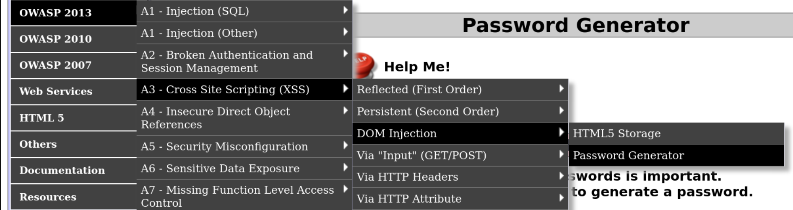
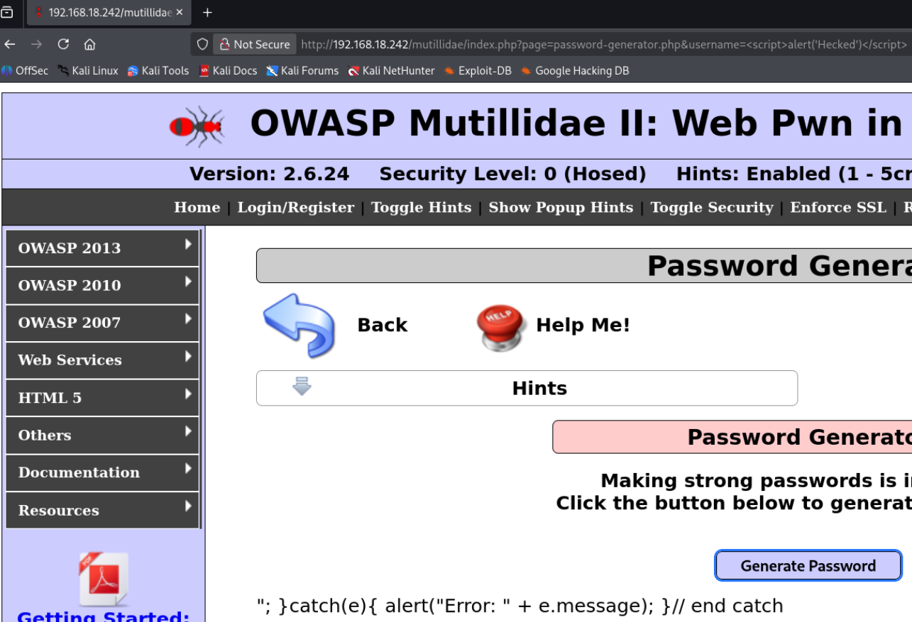
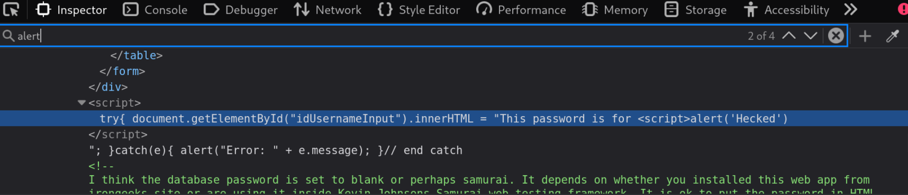
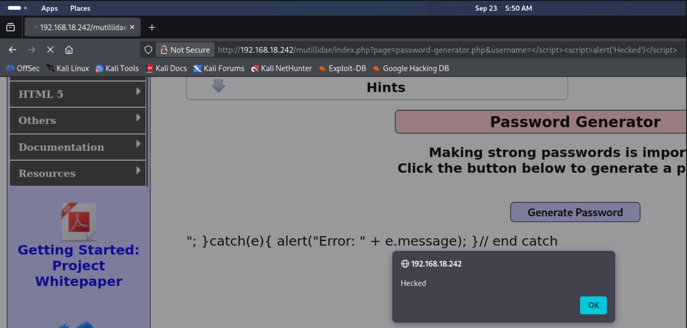

# DOM-based XSS

## Overview

DOM-based XSS is a vulnerability where JavaScript code is executed on the client's side (in their browser). It is very dangerous as it can steal cookies, sensitive information, or redirect the user to malicious sites to download and execute malware for unauthorized access.

Reflected and Stored XSS are already explained in the Fundamentals section: [Web-Application-Pentesting.md](https://github.com/legend017/Ethical-Hacking-Notes/blob/main/Fundamentals/08.Web-Application-Pentesting.md#5-reflected-xss-cross-site-scripting)

---

## What is DOM?

The DOM (Document Object Model) allows JavaScript to change or modify the content of a website dynamically. It consists of:

- Source — takes input or payload (e.g., URL parameter, location.hash)
- Sink — a function that displays the payload without sanitization (e.g., innerHTML, document.write())

---

## DOM-based XSS Explained

In DOM-based XSS, the vulnerability exists entirely within the client-side code. The website's own JavaScript executes the payload right inside the victim's browser.

The application's JavaScript processes untrusted data from a Source (an attacker-controlled input like the URL) and passes it unsanitized to a Sink (a JavaScript function that executes code, like innerHTML). Because this entire data flow happens within the browser, the malicious payload is executed by the client-side JavaScript without ever touching the backend server.

---

## Practical Lab — OWASP Mutillidae II

**Navigation:** OWASP 2013 → A3 Cross Site Scripting → DOM Injection → Password Generator

  
📸 Click to view

   
  

### Key Observation

When we click on the Password Generator and turn on Burpsuite intercept, it does not show any request. This confirms what we discussed — the vulnerability lies in client-side JavaScript and requests are not being sent to the server.

### The Vulnerable URL

http://192.168.18.242/mutillidae/index.php?page=password-generator.php&username=anonymous

There is a username=anonymous parameter. We try to inject JavaScript code there.

### First Attempt

Payload used:

**Result:** No output. An error was displayed instead:

"; }catch(e){ alert("Error: " + e.message); }// end catch

  
📸 Click to view

   
  

### Inspecting the Source

Press F12 to inspect the page source. Search for alert to find the error message code.

  
📸 Click to view

   
  

We find the JavaScript code:

Our input was placed inside the JavaScript code, which is why the payload didn't work — it broke the existing script context.

### The Fix

To make the payload work, we need to close the script tag first and then inject our payload. This escapes the current context and allows our JavaScript to run.

  
📸 Result

   
  

---

## Key Takeaways

- DOM-based XSS happens entirely in the browser — the server never sees the payload
- Burpsuite shows no request because no HTTP request is made
- Source = attacker input; Sink = where it gets executed
- If your payload is placed inside existing JavaScript, close the context first
- Traditional server-side filters won't catch DOM XSS
- WAFs( Web Application Firewall) are blind to it because the payload never reaches the server
