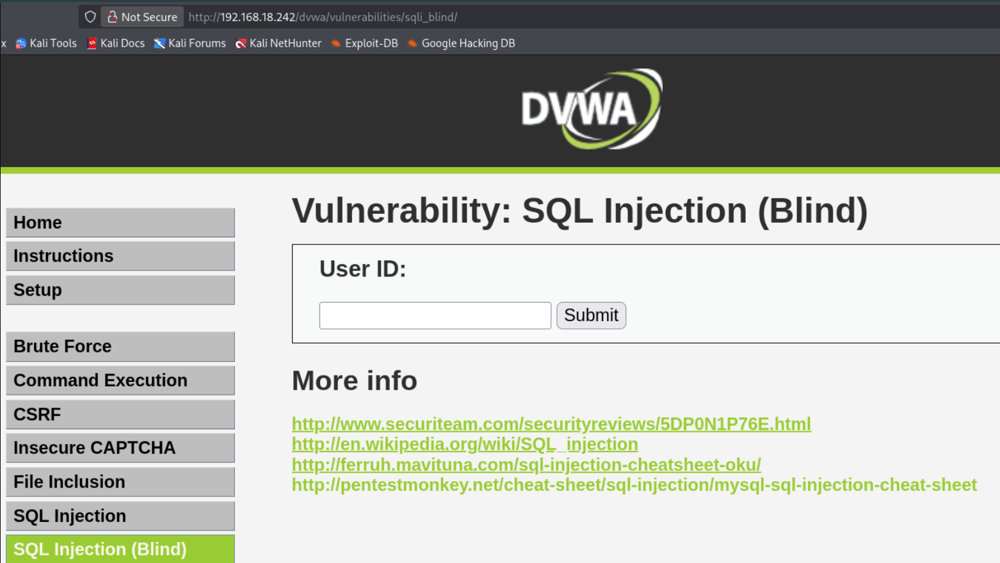
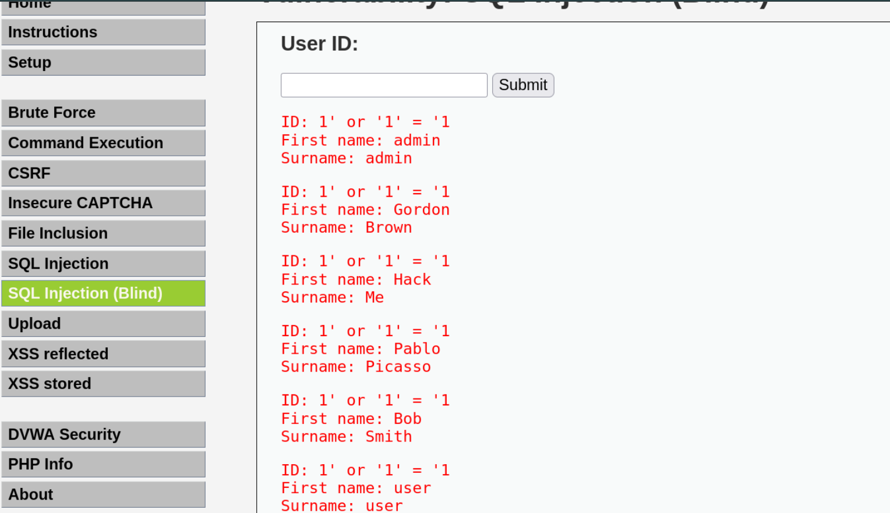
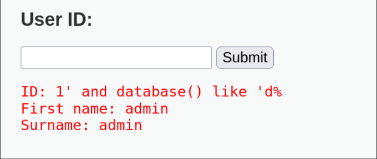
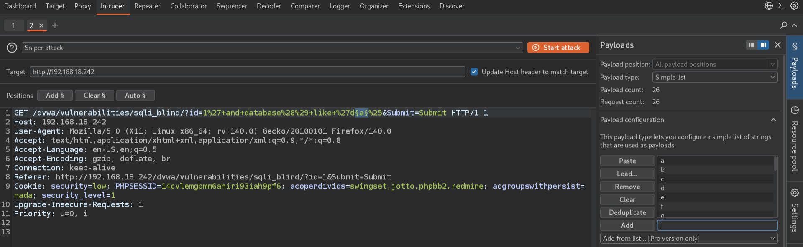
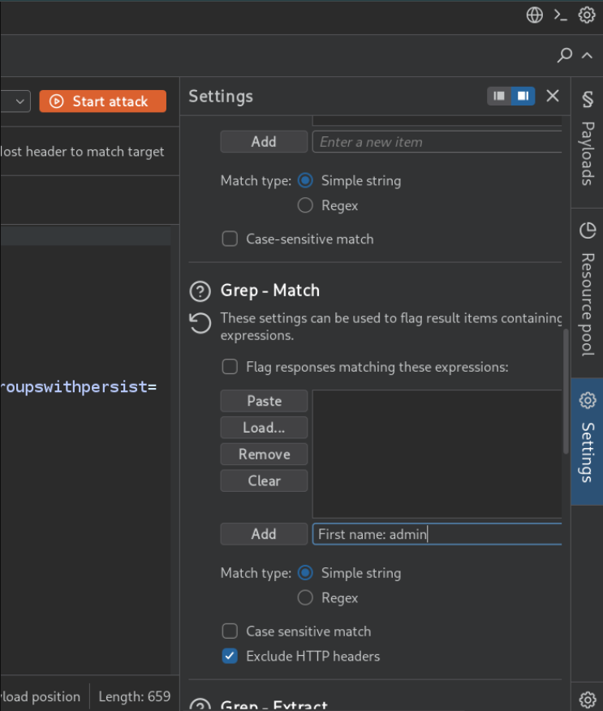
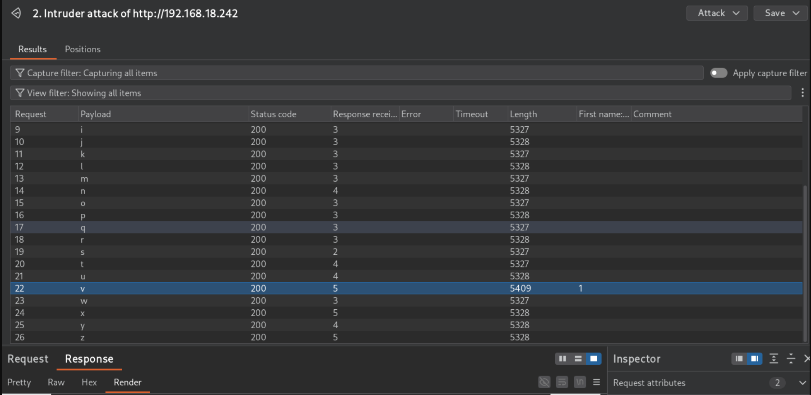

# SQL Injection

## Overview
SQL Injection is a vulnerability where the input field is not properly filtered and accepts SQL queries. This allows an attacker to extract sensitive information such as passwords, contact details, and other data stored in the database.

It is considered one of the most critical vulnerabilities because successful exploitation can give access to all data stored in the database.

---

## Practical — OWASP BWA (Mutillidae II)

**Navigation:** Mutillidae II → OWASP 2013 → A1-Injection (SQL) → SQLi-Extract Data → User Info (SQL)

<details>
  <summary>📸 Click to view</summary>
  <br>
  
</details>

The page asks for a username and password to log in. Since we don't know any valid credentials, we try different SQL injection approaches.

---

### Step 1: Test for Vulnerability

First, try any random username and password — it fails with "invalid username or password."

The backend wraps the input in single quotes, so the query looks like this:
```
username = 'tony'
password = 'tony123'
```
We add a `'` at the end of the input to close the existing quote. If the server returns an error, it means our input is being interpreted as SQL — confirming the vulnerability.

**Test input:**
```
username: test'
password: test'
```
**Result:** An error message appeared, confirming the application is vulnerable to SQL injection.

<details>
  <summary>📸 Click to view</summary>
  <br>
  
</details>

---

### Step 2: Bypass Authentication

**Payload:**
```
username: test' or '1' = '1
password: test' or '1' = '1
```
**How it looks in the backend query:**
```
username: 'test' or '1' = '1'
password: 'test' or '1' = '1'
```
**Why this works:**
- The `'` closes the username string
- `OR '1' = '1'` is always true
- The original `AND password = '...'` check becomes irrelevant because OR overrides it
- The query returns all users instead of failing

**Result:** The application bypasses authentication and displays all users' names and passwords.

<details>
  <summary>📸 Result</summary>
  <br>
  
</details>

---

## Key Takeaways

- A single `'` can reveal if an input is vulnerable — error = unfiltered input
- `OR '1' = '1'` is a classic authentication bypass payload
- The `OR` operator makes the entire condition true regardless of the original check
- Never concatenate user input directly into SQL queries
- Always use prepared statements / parameterized queries
- Input validation and sanitization prevent this attack

## Blind SQL Injection

Blind SQL injection is a type of SQL injection where the application is vulnerable but the results are not reflected in the response. The attacker cannot see database output directly.

Instead, the attacker asks the database true/false questions and observes how the application responds (different content, error messages, delays) to extract information one piece at a time.

---

## Practical — DVWA (Damn Vulnerable Web Application)

**Target:** DVWA → SQL Injection (Blind)
**Login:** admin / admin

<details>
  <summary>📸 Click to view</summary>
  <br>
  
</details>

---

### Step 1: Test for Vulnerability

If you enter a single quote in the input field, it returns nothing — this is the "blind" part. There's no visible SQL error.

Try:
```
1' or '1' = '1
```
**Result:** It returns all usernames. This confirms the application is vulnerable — it accepted our SQL input, executed it, and returned data it wasn't supposed to. The application is supposed to output only one username at a time.

<details>
  <summary>📸 Click to view</summary>
  <br>
  
</details>

---

### Step 2: Guess the Database Name

Now let's try to find the database name. This is hard to do blind because it returns nothing visible.

We need to guess the database name character by character using the SQL LIKE operator. LIKE is used to find a specified pattern in a column.

**Manual attempt:**
```
1' and database() like 'a%
```
This tries to guess if the database name starts with a. It returns nothing — no database starts with a.

Try again with other letters until something matches:
```
1' and database() like 'd%
```
**Result:** Output appears — the database name starts with d.

<details>
  <summary>📸 Click to view</summary>
  <br>
  
</details>

---

### Step 3: Automate with Burpsuite Intruder

Doing this manually for every character would take forever. We use Burpsuite.

We already know the first letter is d. Now let's guess the second letter.

**Payload used:**
```
1' and database() like 'da%
```
Intercept the request and send it to Intruder.

Add a payload position where the second character should be. Manually type a-z as the payload list.

<details>
  <summary>📸 Click to view</summary>
  <br>
  
</details>

---

### Step 4: Analyze Results

Start the attack.

When the response shows "First name: admin", we've successfully identified the character.

<details>
  <summary>📸 Click to view</summary>
  <br>
  
</details>

Look at the Length column — the correct letter has a different response length than the others.

<details>
  <summary>📸 Result</summary>
  <br>
  
</details>

---

### Step 5: Repeat

Repeat this process for each character in the database name.

**Result:** The database name is dvwa.

Going deeper into the database (tables, columns, data) would require guessing each character manually — which is why blind SQL injection is slow and painful without automation.

---

## Key Takeaways

- Blind SQLi = no visible output — you infer data from response behavior
- LIKE operator allows pattern matching character by character
- Burpsuite Intruder automates the guessing process
- Different response length = correct character found
- Blind SQLi is slow but fully exploitable
- Tools like SQLmap automate the entire process
- This is why DBAs hate blind SQLi — it works even when errors are hidden
