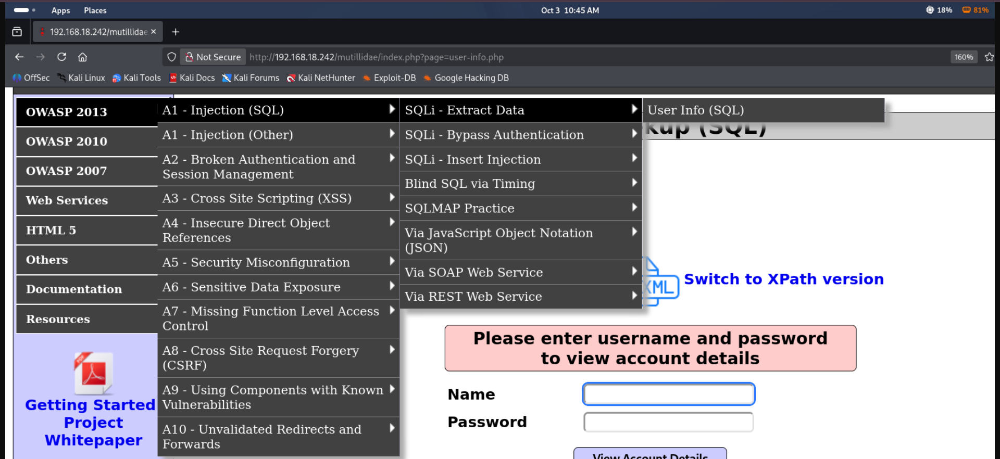
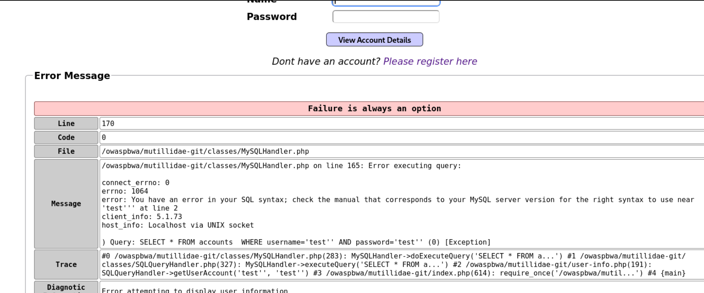
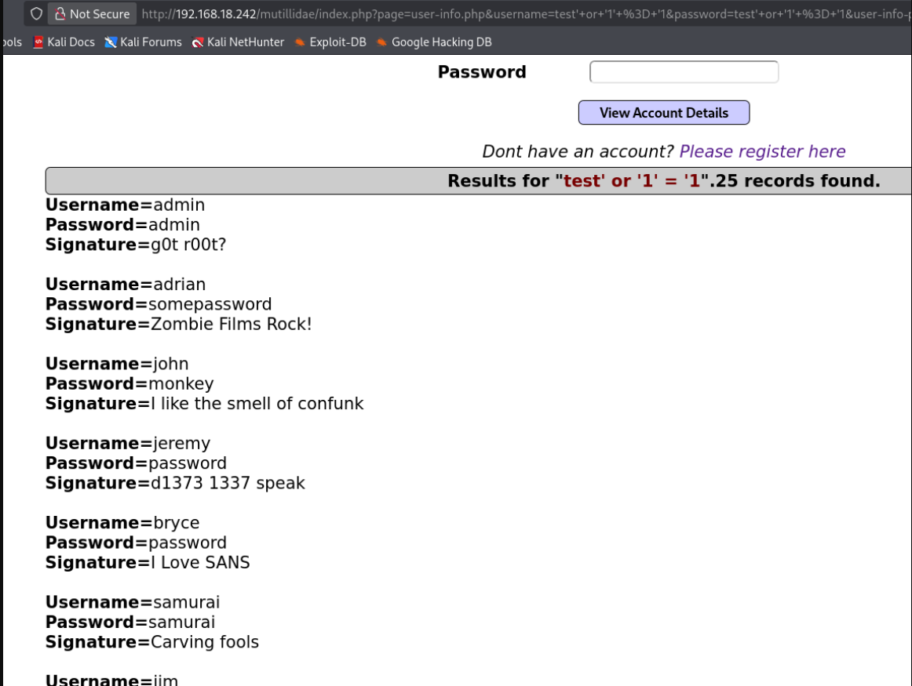

# SQL Injection

## Overview
SQL Injection is a vulnerability where the input field is not properly filtered and accepts SQL queries. This allows an attacker to extract sensitive information such as passwords, contact details, and other data stored in the database.

It is considered one of the most critical vulnerabilities because successful exploitation can give access to all data stored in the database.

---

## Practical — OWASP BWA (Mutillidae II)

**Navigation:** Mutillidae II → OWASP 2013 → A1-Injection (SQL) → SQLi-Extract Data → User Info (SQL)

  
📸 Click to view

   
  

The page asks for a username and password to log in. Since we don't know any valid credentials, we try different SQL injection approaches.

---

### Step 1: Test for Vulnerability

First, try any random username and password — it fails with "invalid username or password."

The backend wraps the input in single quotes, so the query looks like this:

username = 'tony'
password = 'tony123'

We add a `'` at the end of the input to close the existing quote. If the server returns an error, it means our input is being interpreted as SQL — confirming the vulnerability.

**Test input:**

username: test'
password: test'

**Result:** An error message appeared, confirming the application is vulnerable to SQL injection.

  
📸 Click to view

   
  

---

### Step 2: Bypass Authentication

**Payload:**

username: test' or '1' = '1
password: test' or '1' = '1

**How it looks in the backend query:**

username: 'test' or '1' = '1'
password: 'test' or '1' = '1'

**Why this works:**
- The `'` closes the username string
- `OR '1' = '1'` is always true
- The original `AND password = '...'` check becomes irrelevant because OR overrides it
- The query returns all users instead of failing

**Result:** The application bypasses authentication and displays all users' names and passwords.

  
📸 Result

   
  

---

## Key Takeaways

- A single `'` can reveal if an input is vulnerable — error = unfiltered input
- `OR '1' = '1'` is a classic authentication bypass payload
- The `OR` operator makes the entire condition true regardless of the original check
- Never concatenate user input directly into SQL queries
- Always use prepared statements / parameterized queries
- Input validation and sanitization prevent this attack

## Blind SQL Injection

Blind SQL injection is a type of SQL injection where the application is vulnerable but the results are not reflected in the response. The attacker cannot see database output directly.

Instead, the attacker asks the database true/false questions and observes how the application responds (different content, error messages, delays) to extract information one piece at a time.
